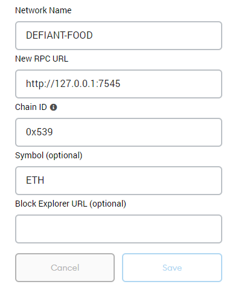

# TIL_DAPP


* [Set Environment](#1-set-environment)
    * [Remix IDE](#11-remix-ide)
    * [Truffle](#12-truffle)
* [Token Tutorial](#token-tutorial)
# 1. Set Environment
```bash
$ npm install [-g] truffle  # local로 깔면 실행할 때 npx truffle
$ npm install @openzeppelin/contracts
```
### **Connect Ganache network to Metamask**
#### Set Custom RPC
   

## 1.1 Remix IDE
compile과 deploy가 간편한 web editor

### 1) Run
Environment 항목은 해당 노드가 실행되는 환경을 의미.
`Javascript VM`은 브라우저에서 실행되는 테스트용이다. 따라서 contract 배포 즉시 block에 저장한다. (기존 사설망은 평균적으로 13초에 한 번씩 block 생성)
`Injected Web3`는 **Metamask** 같은 tool과 연동되는 network가 연결된다.
`Web3 Provider`는 **Geth**같은 외부 Ethereum node와 연결 하고자 할 때 사용한다.

Account 항목은 해당 network와 연동된 계정 목록을 볼 수 있다.
Deploy가 완료되면 Deployed Contracts에 배포된 contract address가 추가된다.

### Contract test
`JavaScript VM`을 통해 test. main contract에 정의한 state variable을 설정해주면서 deploy
정상적으로 contract가 deploy되면 `Deployed Contracts` 항목에서 내가 원하는 method 실행해보면서 test


## 1.2 Truffle
```
$ truffle init
```
**It makes below directories**  
> contracts/  : Contract files  
> migrations/ : script 작성하는 배치 파일 폴더  
> test/  
> truffle.js : truffle configuration  
> truffle-config.js : truffle configuration example

### 1) Start Develop console
`truffle develop`  
default port is `9545` and no block generation time (internal blockchain)

### 2) Compile Contrats
```
$ truffle compile [--all]
```

### 3) Migration
Smart Contracts가 Ethereum network에 잘 배포되게 돕는 javascript file  
`migrations/` 의 모든 마이그레이션 파일 실행
```
$ truffle migrate [--reset]
```

### 4) EthPM
Ethereum Package Management
```
truffle install <package>[@<version>]
```

```Solidity
pragma solidity ^0.4.2;

import "owned/owned.sol"
contract MyContract is owned {}

var Ens = artifacts.require('ens/ENS');
module.exports = function(deployer) {
    deployer.deploy(Ens);
} 
```


# Token Tutorial
> Ganache에서는 아직 내가 smart contract로 생성한 custom token을 볼 수 있는 방법이 없다. console로 봐야됨
> Metamask에서 'add token'으로 token 생성한 smart contract 주소 입력해서 등록 가능
```bash
$ truffle unbox tutorialtoken
$ truffle compile [--all]
$ truffle migrate [--reset]  # smart contract을 수정해서 재배포 하고 싶을 때마다 이거 해줘야 됨.

$ truffle console [--network development]

> let myToken = await myToken.deployed()
> myToken.symbol()
> myToken.name()
> myToken.decimals()
> myToken.totalSupply()
> myToken.address     # Contract address
> myToken.accounts
> myToken.balanceOf(accounts[0])

# let accounts = await web3.eth.getAccounts()


> let balance = await myToken.balanceOf(accounts[0])
> balance.toNumber()

> myToken.approve(accounts[1], <amount>) # contract 실행자가 1에게 허용할 토큰량
> myToken.allowance(accounts[0], accounts[1]) # 0이 1에게 보낼 수 있는 잔여 토큰 허용량
> myToken.increaseAllowance(<spender>, <addedValue>) # allowance[_msgSender()][spender]
> myToken.transfer(accounts[1], <amount>) # contract 실행자가 1에게 토큰 보냄
> myToken.transferFrom(sender, _msgSender(), <amount>) # approve, allowance 적용된 transfer, allowance[sender][_msgSender()].sub 


# 기존 smart contract을 기반으로 재생성 가능
> let newContract = await myToken.new()
> let newContractInstance = await myToken.at("<Contract_address")


$ npm run dev  # Run the "liteserver" development server for front-end
```

### truffle console의 default user 바꾸기 -> `_msgSender()`
truffle-config.js 에서 `from` property 추가
truffle-config.js 바꿔가면서 터미널에서 truffle console 키면 여러개의 `_msgSender()`로 테스트 가능